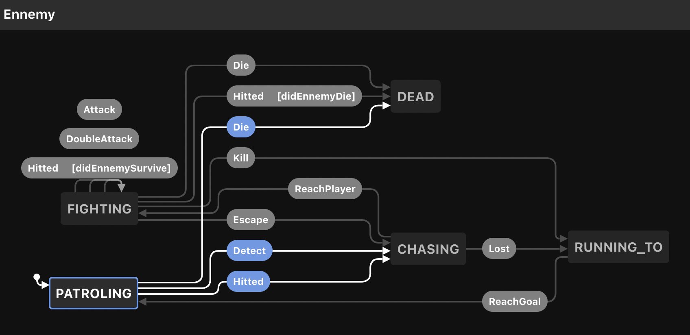

# Intelligence Artificielle pour un Jeu 2D en Typescript

## Contexte

Dans le cadre d'un jeu vidéo en 2D, vue du dessus, on vous a fourni un algorithme pour 
l'intelligence artificielle des ennemis. Bien que cette IA soit relativement simple, nous
vous demandons de valider l'implémentation à l'aide de tests de propriété.

## Spécification

Un Joueur (`type Player`) est défini par:
- son identifiant
- sa position
- sa santé

Un Ennemi (`type Ennemy`) est défini par:
- son identifiant
- sa position initiale
- sa position
- sa santé
- son état

Règles de gestion:
- Tous les ennemis ont 10 points de vie initiaux
- Chaque attaque des ennemis fait un point de dégat au joueur touché

A l'initialisation du jeu, les ennemis patrouillent dans une zone préalablement définie. Lorsqu'un joueur est détecté par un ennemi, ce dernier prend le joueur en chasse jusqu'à arriver au corps à corps, à partir de ce moment il y a un combat pouvant se terminer par la mort d'un des combatant (joueur ou ennemi) ou la fuite du joueur.
Le comportement de l'ennemi peut suivre des chemins alternatif en fonction des évènements survenant en jeu.

L'intégralité du comportement est représenté par la machine a états suivante:

## Structure

- Les types utiles sont définis dans `./types/index.ts`
- Les transitions sont définis dans `./index.ts`

## Exercices

Le but des exercices est de valider l'implémentation fournie à l'aide de tests de propriétés. Il est possible de découvrir des bugs à l'aide de tests pertinents, quand c'est le cas, il est attendu que le bug soit corrigé et que vous ajoutiez un commentaire pour référencer le test qui a permit de découvrir le bug.

0. Clonez le projet et installez les dépendances.

1. Écrivez les generators pour `Player` et `Ennemy` dans `__tests__/generator.ts`

2. Identifiez et écrivez 2 tests d'invariants dans `__tests__/index.ts`

3. Identifiez et écrivez 2 tests d'idempotence dans `__tests__/index.ts`

4. Identifiez et écrivez 1 test d'analogy dans `__tests__/index.ts`

5. Identifiez et écrivez 1 test d'inverse dans `__tests__/index.ts`

6. N'oubliez pas de commit & push le projet